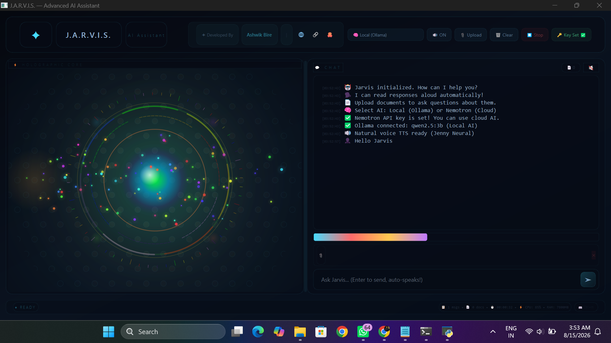
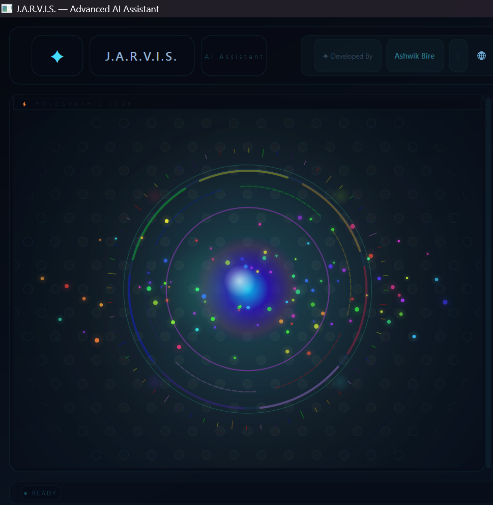
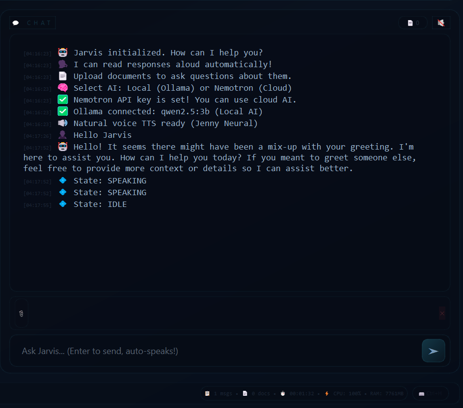
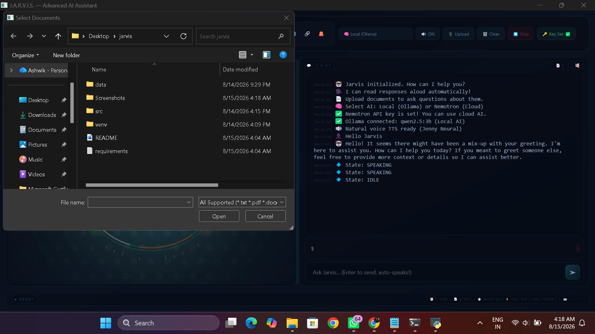

# J.A.R.V.I.S.

Just A Rather Very Intelligent System

Advanced AI Desktop Assistant

Local AI • Cloud AI • Voice • RAG • Document Intelligence • System Monitoring

---

## About

J.A.R.V.I.S. is an AI-powered desktop assistant designed to provide an interactive computer assistant experience through a modern futuristic interface.

It combines AI conversations, local language models, cloud AI, voice responses, document intelligence, RAG capabilities, and system monitoring in one application.

The project explores how an AI assistant can become more interactive, useful, and visually engaging than a traditional chatbot.

---

## Main Interface



The main interface provides the central workspace for interacting with J.A.R.V.I.S.

---

## Holographic Core



The holographic core provides visual feedback for the assistant and creates the futuristic J.A.R.V.I.S. experience.

---

## AI Chat



The chat interface allows users to communicate with the AI assistant through natural language.

---

## Document Intelligence



Documents can be uploaded and processed so users can interact with their content using AI.

---

## Features

### AI Assistant

- Natural language conversations
- Local AI support
- Cloud AI support
- Multiple AI model support
- Context-aware responses
- AI provider switching

### Local AI

J.A.R.V.I.S. supports local AI through Ollama.

Current local model:

- Qwen 2.5 3B

Local AI allows the assistant to operate without sending every conversation to a cloud AI service.

### Cloud AI

J.A.R.V.I.S. can also work with NVIDIA Nemotron for cloud-based AI processing.

This provides an alternative AI environment when additional cloud intelligence is required.

### Voice Assistant

J.A.R.V.I.S. supports voice responses using Microsoft Edge TTS.

Features include:

- Text-to-speech
- Natural voice output
- Audio responses
- Voice-based assistant experience

### Document Intelligence

Supported document formats include:

- PDF
- DOCX
- TXT
- Markdown

Users can upload documents and interact with their content through AI.

### RAG

Retrieval-Augmented Generation allows J.A.R.V.I.S. to use information from uploaded documents as additional context while generating responses.

### System Monitoring

The application can display system information such as:

- CPU usage
- RAM usage
- System status
- Application status

### Futuristic Interface

The user interface is inspired by futuristic AI systems and holographic computer interfaces.

It includes:

- Holographic visual elements
- Animated AI core
- Interactive status indicators
- Futuristic dashboard design
- AI processing feedback

---

## Technology Stack

| Technology | Purpose |
|---|---|
| Python | Application development |
| Ollama | Local AI runtime |
| Qwen 2.5 3B | Local AI model |
| NVIDIA Nemotron | Cloud AI |
| Microsoft Edge TTS | Voice generation |
| RAG | Document-based AI |
| psutil | System monitoring |
| Git | Version control |

---

## Installation

### Requirements

- Python 3.x
- Git
- Ollama
- Required Python packages

### Clone the Project

```bash
git clone
cd jarvis
```

### Create Virtual Environment

Windows:

```bash
python -m venv venv
venv\Scripts\activate
```

### Install Dependencies

```bash
pip install -r requirements.txt
```

---

## Ollama Setup

Install the required local model:

```bash
ollama pull qwen2.5:3b
```

Start Ollama:

```bash
ollama serve
```

Check installed models:

```bash
ollama list
```

---

## Running J.A.R.V.I.S.

Windows:

```cmd
run_jarvis.bat
```

The launcher starts the J.A.R.V.I.S. application.

---

## Project Structure

```text
jarvis/
│
├── screenshots/
│   ├── main_interface.png
│   ├── holographic_core.png
│   ├── chat_interface.png
│   └── document_upload.png
│
├── src/
├── data/
├── requirements.txt
├── run_jarvis.bat
├── README.md
└── .gitignore
```

---

## Security

Keep all API keys and private credentials outside the source code.

Do not commit:

- API keys
- Passwords
- Private credentials
- Secret configuration files

Use environment variables or local configuration files for sensitive information.

---

## Roadmap

### AI

- Local AI
- Cloud AI
- Multiple AI models
- Long-term memory
- Personal knowledge base
- Multi-agent AI

### Voice

- Text-to-speech
- Voice responses
- Wake-word detection
- Speech recognition
- Continuous voice interaction

### Vision

- Computer vision
- Screen understanding
- Object detection
- Camera interaction

### Automation

- Desktop automation
- Application control
- Web automation
- Smart workflows
- IoT integration

---

## Project Philosophy

J.A.R.V.I.S. is built around a simple idea:

AI should feel like an intelligent computer system, not just a chat window.

The project combines artificial intelligence, voice, documents, automation, system information, and an interactive interface into a single desktop assistant.

---

## Author

Ashwik Bire

Data & Business Intelligence Engineer

Python • Artificial Intelligence • Data • Cloud • Automation • Microsoft Fabric • Power BI

---

## J.A.R.V.I.S.

Your AI.  
Your System.  
Your Intelligence.

Built with Python, artificial intelligence, experimentation, and curiosity.
